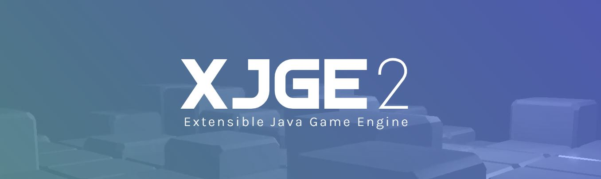

### Hi! I'm Theskidster 👋
---

I'm a software developer who's passionate about crafting compelling experiences and bringing people together through play. I first started making games using the BASIC programming language around 2011 and later switched to Java once those ideas could no longer be contained to a single code file.

Recently (since 2021), I've started utilizing powerful low-level technologies like [OpenGL](https://www.opengl.org/) and [GLFW](https://www.glfw.org/) to create an [Open-Source Game Engine](https://xjge.org/) that lets me quickly iterate and test new gameplay concepts.
  

### Current Project
---

In my spare time I've been developing a small Mario game to test my engines utilities. This process has helped me identify better methods and procedures to use in future projects. Most updates to the engine since 2023 have been in response to some of the things I discovered while creating this game.

It's just a demo right now- but I'm excited to make the repo public sometime later this year!
